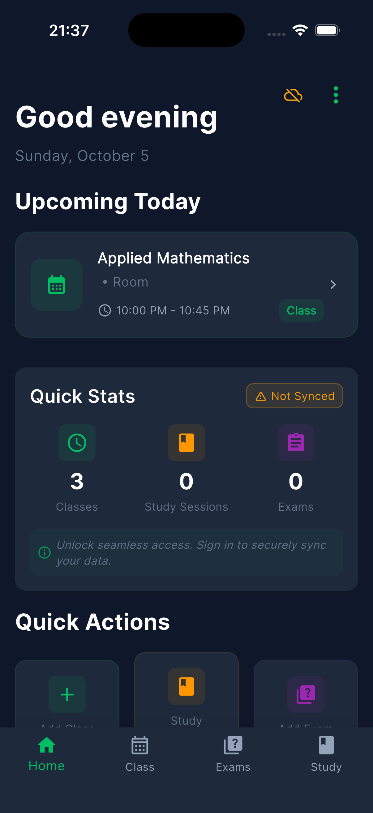
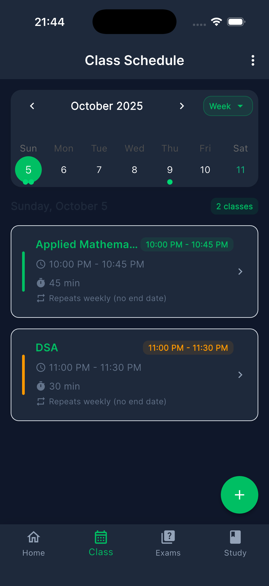
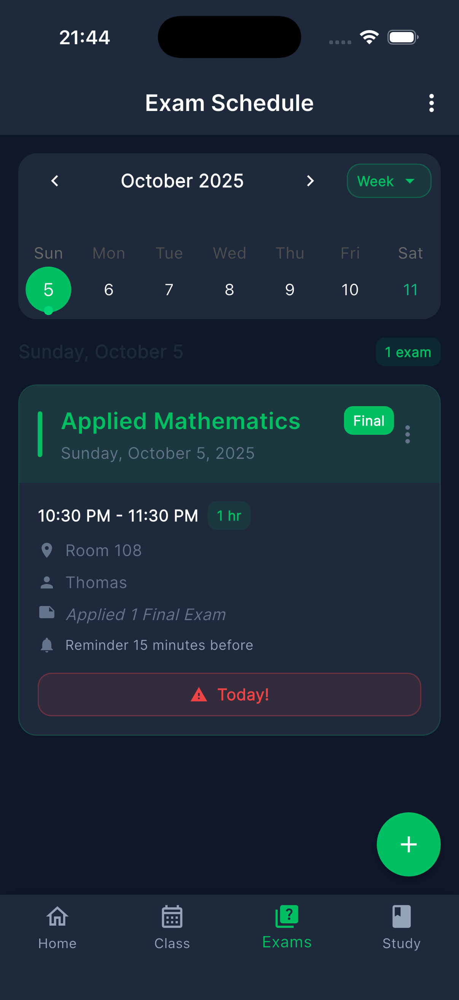
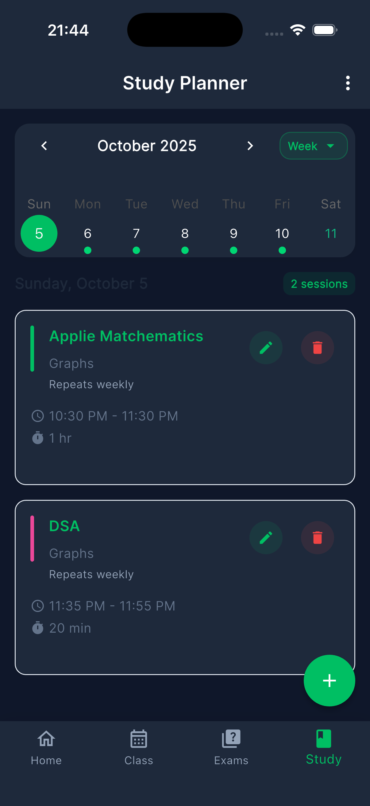

# 📚 Studz - Your Smart Academic Companion

  <h3>🎯 Introducing the definitive academic management tool. This modern, elegant application provides a centralized hub for all your class schedules, exam schedules, and study plans. With proactive, intelligent reminders tailored to your unique pace, it’s designed not just to track your schedule, but to optimize your success.</h3>

---

## 📱 Screenshots

  
  
  
  

---

## ✨ Features

### 📅 **Class Schedule Management**

- **Weekly View**: Clean, organized weekly schedule display with intuitive navigation
- **Calendar Integration**: Interactive calendar with class markers and visual indicators
- **Class Details**: Complete subject information including teacher, room number, and timing
- **Color Coding**: Visual subject differentiation with customizable color schemes
- **Add/Edit Classes**: Easy class addition with comprehensive forms and validation
- **Recurring Classes**: Support for weekly recurring class schedules
- **Date Range**: Set start and end dates for semester-based scheduling

### 📝 **Exam Schedule Management**

- **Single Date Exams**: Schedule one-time exams with specific dates and times
- **Exam Types**: Support for various exam types (Midterm, Final, Quiz, Assignment, etc.)
- **Exam Details**: Complete exam information including subject, type, date, time, room, and instructor
- **Visual Indicators**: Color-coded exam cards with urgency warnings and priority levels
- **Countdown Display**: Shows days until exam with priority indicators and visual alerts
- **No Recurring**: Each exam is a single event (no weekly repetition needed)

### 📚 **Study Planner**

- **Study Sessions**: Schedule dedicated study time for specific topics and subjects
- **Progress Tracking**: Track session status (Pending, In Progress, Completed, Cancelled)
- **Duration Management**: Flexible session duration from 30 minutes to 3 hours
- **Topic Organization**: Organize study sessions by subject and specific topics
- **Session History**: View past study sessions and track your progress

### 🔔 **Smart Notifications**

- **Class Reminders**: Get notified before each class starts with customizable timing
- **Exam Reminders**: Receive notifications before exams with flexible reminder intervals
- **Study Reminders**: Receive notifications before study sessions to stay on track
- **Customizable Timing**: Set reminder intervals (15, 30, 60 minutes, 2 hours, or 1 day before)
- **Local Notifications**: Works offline with reliable local notification system

### 🎨 **Modern UI/UX**

- **Material Design 3**: Latest Material Design principles and components
- **Dark/Light Theme**: Automatic theme switching based on system preference
- **Responsive Design**: Optimized for various screen sizes and orientations
- **Smooth Animations**: Elegant transitions and micro-interactions throughout the app
- **Intuitive Navigation**: Bottom navigation with clear sections (Class, Exams, Study)
- **Accessibility**: Full accessibility support with screen reader compatibility

---

---

## 📋 Requirements

- **Android**: API level 21 (Android 5.0) or higher
- **iOS**: iOS 11.0 or higher
- **Permissions**:
  - Notification permissions (for reminders)
  - Storage permissions (for data persistence)

## 📱 Supported Platforms

- ✅ **Android** (API 21+)
- ✅ **iOS** (iOS 11.0+)
- 🔄 **Web** (Coming Soon)
- 🔄 **Desktop** (Coming Soon)

## 📞 Support

- **Email**: abel.hubena.developer@gmail.com

  
<strong>Made with ❤️ for students worldwide</strong>

  
⭐ Star this repository if you find it helpful!

